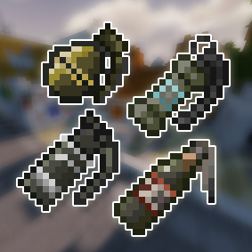
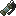
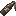

<h1>Counter Strike Grenades</h1>

This mod provides utilities in CS2(with smoke fallen generation) to Minecraft.

Currently we dont have proper 3D models yet, and ultities are rednerered as texture when they are thrown, like ender
pearl.

|  |  |  |  |  
|:--------------------------------------------------------------------------------|:--------------------------------------------------------------------------------------|:--------------------------------------------------------------------------------|:-----------------------------------------------------------------------------------------|:---------------------------------------------------------------------------|

## Features

- [x] HE Grenades
- [x] Flash Bang
- [x] Incendiary (Molotov)
    - [x] Different varaints based on team
    - [x] Interaction with Smoke Grenades
- [ ] Decoy
- [x] Smoke Grenade

Showcase: [YouTube](https://www.youtube.com/watch?v=wpVh0Wzt4uQ)

## Screenshots

